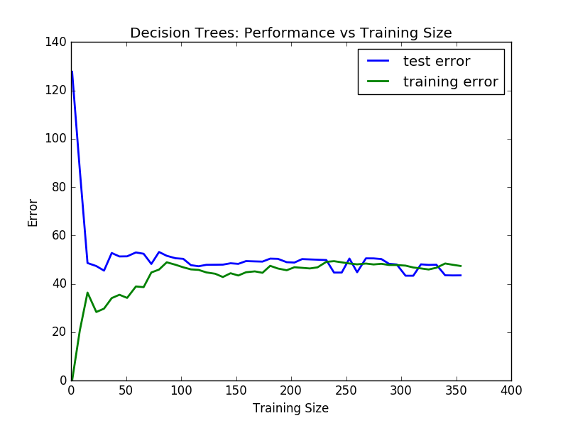
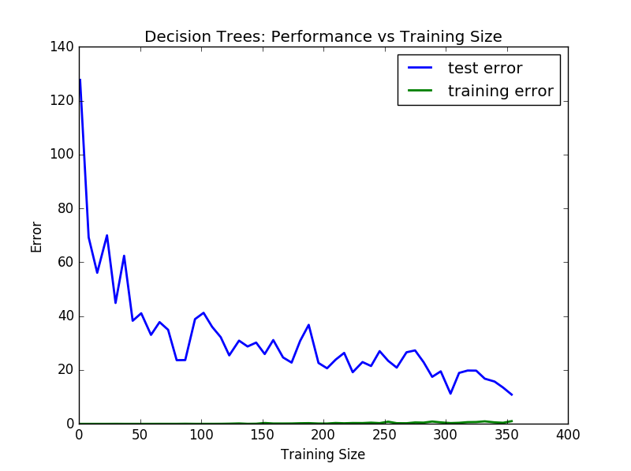
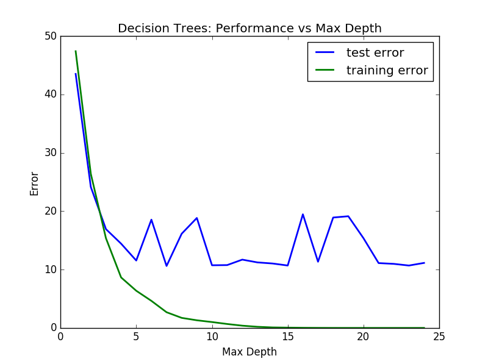

% Predicting Boston housing prices
% Wei Cui
% 2015-12-15

# Statistical analysis and data exploration

Some information about the data set can be found below.

 * Number of samples: 506
 * Number of features: 13
 * Minimum housing price: 5.0
 * Maximum housing price: 50.0
 * Mean house price: 22.5328063241
 * Median house price: 21.2
 * Standard deviation of housing prices: 9.18801154528

# Evaluating model performance
## Which measure of model performance is best to use for predicting Boston housing data and analyzing the errors? Why do you think this measurement most appropriate? Why might the other measurements not be appropriate here?

I believe the mean squared error (MSE) is better than mean absolute error (MAE), since MSE emphasizes large error unlike absolute mean or median error. But here I prefer R-squared values, which is nothing else but one minus normalized MSE by the variouse of data input. 

## Why is it important to split the Boston housing data into training and testing data? What happens if you do not do this?

The purpose of splitting data into training and testing dataset is to avoid the over-fitting and under-fitting. Without testing dataset, the model is optimized only for training dataset, and the performance for the data outside the training dataset is unknown.
With testing dataset, the model will be verified to ensure better performance for data outside of training dataset.

## What does grid search do and why might you want to use it?

Grid search is a major method used in parameter tuning and the selection of appropriate model. Also, it often used in cross validation folds to reduce the over-fitting and under-fitting risk.

## Why is cross validation useful and why might we use it with grid search?

The cross validation is assessing the performance of a model, which is trained in an machine learning algorithm, on an independent data set, in order to limit the problems like "over-fitting"

Gird search performs 3-fold cross validation, so not only can we limit the cross-over-fitting problem, but also the optimize the parameters also through the cross validation.

# Analyzing Model Performance

## Look at all learning curve graphs provided. What is the general trend of training and testing error as training size increases?

As the training size increases, the testing error reduces dramatically at beginning. However, for very small training size the training error is almost zero, then increase. Then the training error and testing error are roughly equal to each other, the two errors trend became flat and remain roughly constant when training size increases.

## Look at the learning curves for the decision tree regressor with max depth 1 and 10 (first and last learning curve graphs). When the model is fully trained does it suffer from either high bias/under-fitting or high variance/over-fitting?

For the model with 1 max depth (the figure above), there must be some high bias, since the under-fitting problem, since even with a lot of training size, the error of testing data is still very high. The model with 10 max depth (the figure below) is a overfitted model, since the error of training dataset is almost zero.

## Look at the model complexity graph. How do the training and test error relate to increasing model complexity? Based on this relationship, which model (max depth) best generalizes the dataset and why?

As the model complexity (max depth) grows, the training errors decrease very fast, and it is very close to 0 when max depth larger than 15. This means the model is over-fitted. However, the testing errors only decreases at beginning and then fluctuates. 

The max depth of best model is 7 based on the above relationship.

# Model Prediction

## Model makes predicted housing price with detailed model parameters (max depth) reported using grid search. Note due to the small randomization of the code it is recommended to run the program several times to identify the most common/reasonable price/model complexity.
<pre><code>
Final Model: 
DecisionTreeRegressor(criterion='mse', max_depth=6, max_features=None,
           max_leaf_nodes=None, min_samples_leaf=1, min_samples_split=2,
           min_weight_fraction_leaf=0.0, random_state=None,
           splitter='best')
House: [11.95, 0.0, 18.1, 0, 0.659, 5.609, 90.0, 1.385, 24, 680.0, 20.2, 332.09, 12.13]
Prediction: [ 20.76598639]
</code></pre>

The final decision tree regressor uses the following optimized parameters:

 * max_depth:6
 * min_samples_leaf = 1
 * min_samples_split = 2

## Compare prediction to earlier statistics and make a case if you think it is a valid model.

For particular example with the house parameters: `[11.95, 0.0, 18.1, 0, 0.659, 5.609, 90.0, 1.385, 24, 680.0, 20.2, 332.09, 12.13]`. The prediction is 20.76598639. This value is very close to the mean and median price, so I would say it is a valid model.
